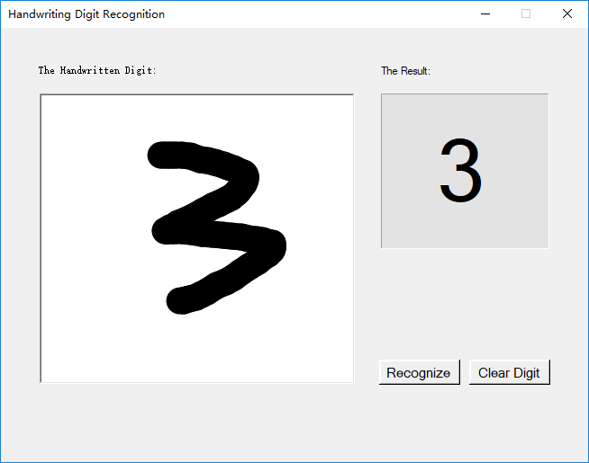

# Application Introduction

You can first draw any digit in the white pane using the mouse and the application can parse the result when clicking the "Recognize" button.

# Repository Content

There are 2 solutions offering the same UI but interacting with different backends.
- MnistDemo.FlaskServer  
  Set up a [Python Web server](MnistDemo.FlaskServer/Mnist.LeNet/serve_online.py) which calls TensorFlow for image classification based on Checkpoint.
- MnistDemo.TensorFlowSharp  
  Freeze the inference graph and wrap it as a .NET class library based on the 3rd-party project titled [TensorFlowSharp](https://github.com/migueldeicaza/TensorFlowSharp).

# Prerequisites for Build and Run

Visual Studio 2015+ with:
- Python Tools
- C# and WPF

Runtime:
- .NET Framework 4.5+
- Python 3.5+
